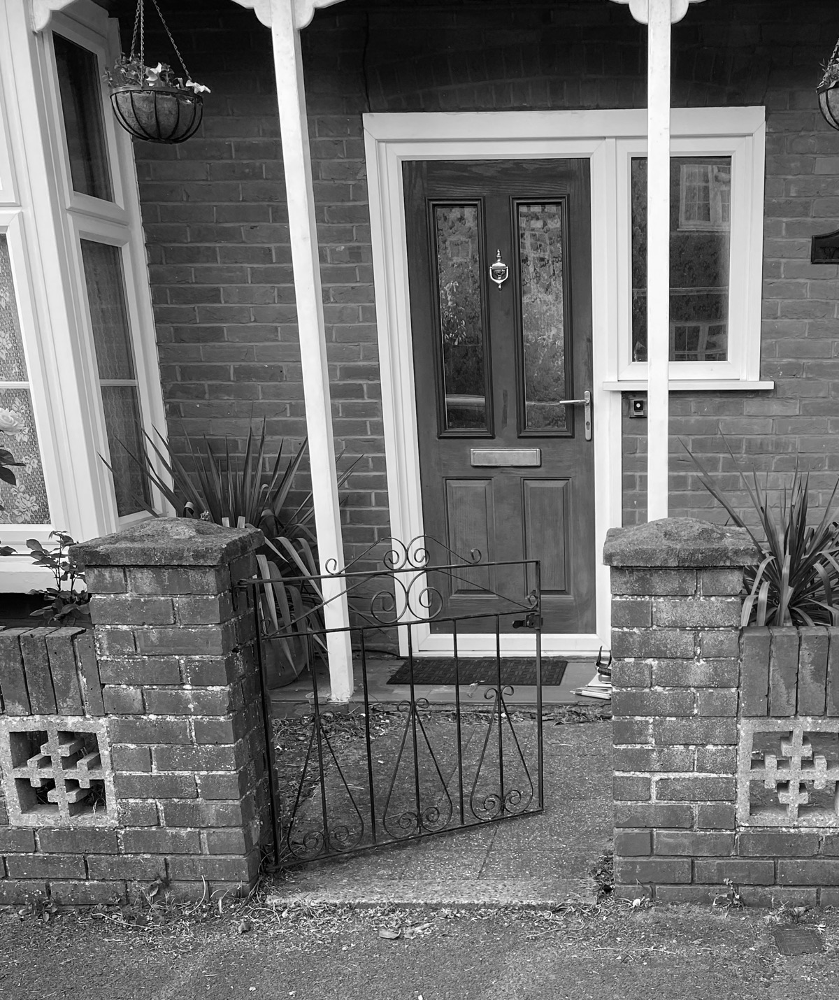

**One-tenth of a second** is all it takes to form a first impression, so front gardens have a big responsibility. This beautiful Edwardian-style house was being let down by its outside space, with cracked concrete and weedy borders. Now it compliments the architecture perfectly, and is the envy of the neighbours.

## The Challenge

## The Design Development

I began with the central path. The Edwardian architecture, with bay windows and white-painted woodwork, demanded something classic and timeless. I designed a tiled path, complete with a contrasting border pattern and rope-top edging, to lead visitors to the front door in style.

## The Transformation



## The Timeline



- Survey - June 2023
- Concept development - July 2023
- Documentation drawing - September 2023
- Planting design - January 2024
- Hard landscaping - April 2024
- Plant sourcing - April 2024
- Planting - May 2024


